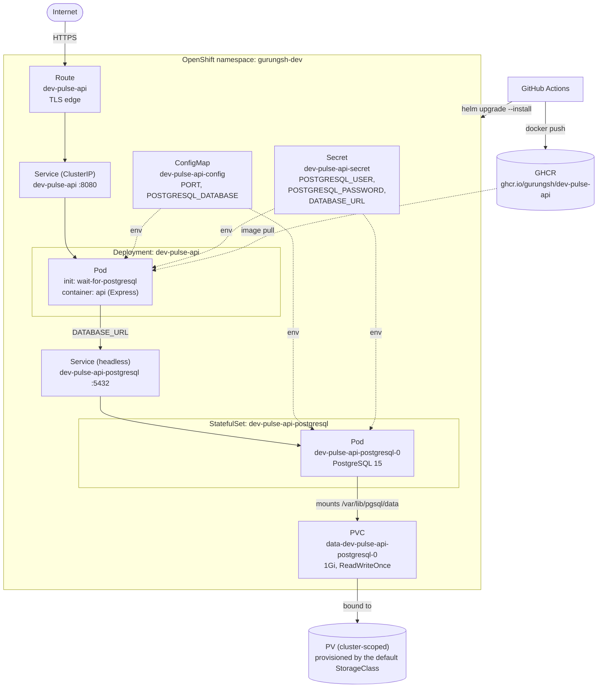

# Deploying dev-pulse-api to OpenShift



The app and its PostgreSQL database are packaged as a Helm chart in `chart/dev-pulse-api`. A release creates:

| Resource                                        | Purpose                                                        |
| ----------------------------------------------- | -------------------------------------------------------------- |
| Deployment `dev-pulse-api`                      | The Express app. An init container waits for the database.     |
| Service `dev-pulse-api`                         | Routes traffic to the app pods on port 8080.                   |
| Route `dev-pulse-api`                           | Public HTTPS URL (OpenShift's equivalent of an Ingress).        |
| StatefulSet `dev-pulse-api-postgresql`          | PostgreSQL 15, one pod (`dev-pulse-api-postgresql-0`).         |
| Service `dev-pulse-api-postgresql`              | Headless service that gives the database a stable DNS name.    |
| PVC `data-dev-pulse-api-postgresql-0`           | 1Gi volume for the database files, from the default StorageClass. |
| ConfigMap `dev-pulse-api-config`                | `PORT` and database name.                                      |
| Secret `dev-pulse-api-secret`                   | Database user and password, and the app's `DATABASE_URL`.      |

Settings are in `chart/dev-pulse-api/values.yaml`. `postgresql.user` and `postgresql.password` have no defaults and must be passed at install time with `--set-string postgresql.user=... --set-string postgresql.password=...`. Use only letters and digits in both: `--set-string` fails on a comma, and a space turns into `+` in `DATABASE_URL`.

PostgreSQL creates the user only when it first sets up an empty data volume. Changing the user later won't rename it in the database, so the app can't log in. To change it, delete the PVC and start over with an empty database.

## How a deploy runs

`.github/workflows/deploy.yml` runs on every push to `main`. You can also start it by hand with **Run workflow** on the Actions tab. It:

1. Builds the image from the `Dockerfile` and pushes it to `ghcr.io/gurungsh/dev-pulse-api`, tagged with the commit SHA and `latest`.
2. Logs in to OpenShift and runs `helm upgrade --install` with that image tag and the database password. Helm waits until the pods are ready.

When the app container starts, `npm start` runs `prisma migrate deploy`, which creates or updates the tables before the server starts listening. The database starts empty.

The image is pushed with the workflow's built-in `GITHUB_TOKEN`. GitHub makes a new package private, so the first run will likely fail: OpenShift can't pull the image, the pod stays in `ImagePullBackOff`, and Helm times out after 10 minutes. Open the `dev-pulse-api` package on your GitHub profile, go to **Package settings**, change its visibility to **Public**, then re-run the workflow.

## Working with the release

The app deploys to the `gurungsh-dev` namespace. After an install or upgrade, Helm prints the deployed image tag, the public URL command and the database shell command (from `templates/NOTES.txt`).

Public URL of the services endpoint:

```bash
echo "https://$(oc get route dev-pulse-api -n gurungsh-dev -o jsonpath='{.spec.host}')/api/v1/services"
```

The database is reachable inside the namespace at `dev-pulse-api-postgresql:5432`, with its data in the PVC `data-dev-pulse-api-postgresql-0`. To open a database shell:

```bash
oc exec -it dev-pulse-api-postgresql-0 -n gurungsh-dev -- psql -d devpulse
```

`helm uninstall dev-pulse-api` removes everything except the PVC, so the data survives a reinstall. Delete the PVC to wipe the database.
